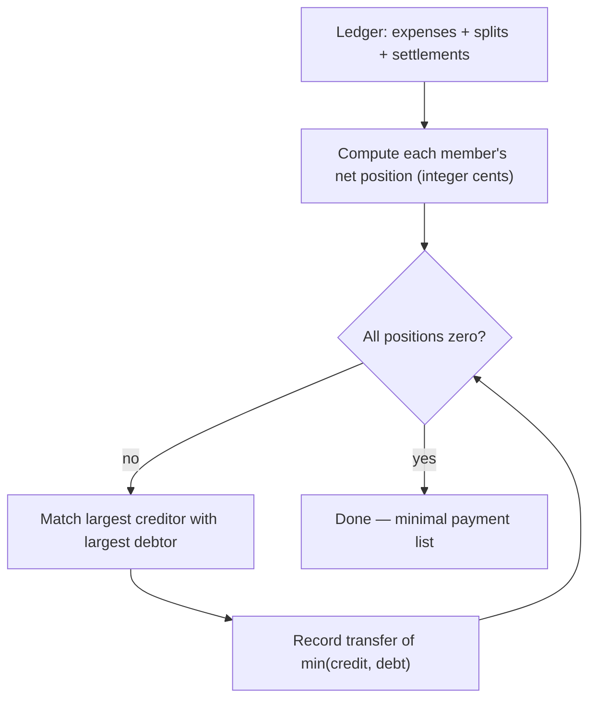

<div align="center">

# 💸 SplitLedger

**Split expenses with your group. Settle up in the fewest possible payments.**

[](https://react.dev/)
[](https://www.typescriptlang.org/)
[](https://vite.dev/)
[](https://tailwindcss.com/)
[](https://expressjs.com/)
[](https://www.prisma.io/)
[](https://www.postgresql.org/)

</div>

A Splitwise-style group expense splitter, built **fundamentals-first**: authentication, money math, and the settlement algorithm are all hand-rolled and explainable — no auth library, no money library, no framework magic. Every line of core logic exists because it was reasoned about, not installed.

---

## 🤔 Why SplitLedger?

Most expense-splitter tutorials bolt together libraries until the demo works. SplitLedger takes the opposite approach — the interesting problems are solved from first principles:

- **Money is never a float.** All arithmetic happens in integer cents, because `0.1 + 0.2 !== 0.3` is not a rounding error you want in a ledger.
- **Balances are never stored.** Every balance you see is recomputed live from the ledger, so it is mathematically impossible for a balance to drift out of sync with the expenses behind it.
- **Auth is built by hand.** JWT access + refresh token rotation, bcrypt hashing, httpOnly cookies — implemented directly against the primitives so every security decision is deliberate.
- **Settlement is a pure function.** The "who pays whom" algorithm is DB-free, unit-testable, and written in its obviously-correct form.

---

## ✨ Features

| | Feature | Description |
|---|---|---|
| 👥 | **Groups** | Create groups, invite members by email, leave once your balance is settled, delete groups you created |
| ✉️ | **Invitations** | Invites must be explicitly accepted — nobody is added to a group without consent |
| 💱 | **Per-group currency** | Each group is denominated in one currency chosen at creation (USD, EUR, GBP, INR, CAD, AUD, SGD) |
| 🧾 | **Flexible splits** | Equal, custom-amount, percentage, and share-based splits; edit or delete your own entries |
| ⚖️ | **Live balances** | Every member's net position, derived from the ledger on every read — no stored balance to go stale |
| 🤝 | **Settle up** | A minimum-transaction algorithm suggests who pays whom; one click records it and balances update instantly |
| 📜 | **Activity feed** | A unified chronological stream of expenses and settlements, filterable by member |
| 🔐 | **Hand-rolled auth** | Access token in memory, refresh token in an httpOnly cookie, silent session restore on page load |

---

## 🧮 How settle-up works

Given any set of expenses and past settlements, SplitLedger computes the smallest set of payments that zeroes everyone out — a greedy max-creditor / max-debtor matching:



The algorithm lives in [`backend/src/services/settlement.service.ts`](backend/src/services/settlement.service.ts) as a pure function: no database, no side effects, fully unit-testable.

---

## 🧠 Design decisions that matter

- **Balances are always derived, never stored.** `GET /groups/:id/balances` recomputes from `Expense` + `ExpenseSplit` + `Settlement` on every call. It costs a little on each read and guarantees the number can never disagree with the ledger.
- **All money math is integer cents.** Parsing, split validation, and remainder distribution happen in cents (`backend/src/lib/money.ts`); Postgres stores `Decimal(10,2)`.
- **Currency is per-group and immutable.** Set at creation, never converted — changing it later would silently re-denominate historical expenses. The allowlist is restricted to 2-decimal ISO 4217 currencies because the cents math assumes a minor unit of 100 (so no JPY).
- **Refresh tokens live in an httpOnly cookie** scoped to `/auth/refresh`; access tokens live only in frontend memory — never in `localStorage`. A silent refresh on page load restores the session.
- **Business logic lives in `services/`.** Routes stay thin: parse, validate, translate errors to status codes, nothing else.

---

## 🏗️ Architecture

```
splitledger/
├── docker-compose.yml           # Postgres 16 for local dev
├── backend/
│   ├── prisma/schema.prisma     # 7 models: User, Group, GroupMember, GroupInvite,
│   └── src/                     #   Expense, ExpenseSplit, Settlement
│       ├── routes/              # thin HTTP layer — parse, validate, map errors
│       ├── services/            # all business logic (settlement algorithm lives here)
│       ├── middleware/          # JWT auth guard
│       └── lib/                 # money.ts (integer-cents math), currency.ts, prisma.ts
└── frontend/
    └── src/
        ├── pages/               # Login, Register, Dashboard, GroupDetail
        ├── components/          # tabs, modals, cards, app shell
        ├── api/                 # fetch wrapper with in-memory access token
        └── context/             # AuthContext — session state + silent refresh
```

---

## 🛠️ Tech stack

| Layer | Choice | Why |
|---|---|---|
| Frontend | React 19 + TypeScript + Vite | Fast dev loop, typed end to end |
| Styling | Tailwind CSS v4 | Utility-first, no CSS drift |
| Backend | Node.js + Express 5 + TypeScript | Minimal framework — the logic is the point |
| ORM / DB | Prisma 7 + PostgreSQL 16 | Typed queries, migrations, `Decimal` money columns |
| Auth | JWT + bcrypt, rolled by hand | Every security decision made explicitly, not inherited |
| Local infra | Docker Compose | One command for a reproducible Postgres |

---

## 🚀 Getting started

**Prerequisites:** Node 22+, Docker.

### 1. Database

```bash
cp .env.example .env          # then edit values (especially the password)
docker compose up -d          # starts Postgres 16 with a named volume
```

### 2. Backend

```bash
cd backend
cp .env.example .env          # see variables below
npm install
npx prisma migrate dev        # create schema
npm run dev                   # → http://localhost:4000
```

| Variable | Purpose |
|---|---|
| `DATABASE_URL` | Postgres connection string (matches the Docker values) |
| `JWT_ACCESS_SECRET` / `JWT_REFRESH_SECRET` | Signing secrets — generate each with `openssl rand -hex 32` |
| `FRONTEND_URL` | Frontend origin for CORS (`http://localhost:5173` in dev) |
| `PORT` | API port (default `4000`) |

### 3. Frontend

```bash
cd frontend
npm install
npm run dev                   # → http://localhost:5173
```

The frontend reads `VITE_API_URL` (defaults to `http://localhost:4000`); the backend's `FRONTEND_URL` must match the frontend origin for CORS.

---

## 📡 API reference

All routes except `/auth/*` require a `Bearer` access token. Group routes verify membership and return `403` for non-members.

| Method | Endpoint | Description |
|---|---|---|
| `POST` | `/auth/register` | Create an account |
| `POST` | `/auth/login` | Log in — returns access token, sets refresh cookie |
| `POST` | `/auth/refresh` | Exchange refresh cookie for a new access token |
| `POST` | `/auth/logout` | Invalidate the session |
| `POST` / `GET` | `/groups` | Create / list your groups |
| `GET` / `DELETE` | `/groups/:id` | Group detail / delete (creator only) |
| `POST` | `/groups/:id/invites` | Invite a member by email |
| `POST` | `/groups/:id/leave` | Leave — requires a zero balance |
| `GET` | `/invites` | Pending invites for the current user |
| `POST` | `/invites/:id/accept` · `/decline` | Respond to an invite |
| `POST` / `GET` | `/groups/:id/expenses` | Create / list expenses |
| `PUT` / `DELETE` | `/groups/:id/expenses/:eid` | Edit / delete an expense |
| `GET` | `/groups/:id/balances` | Net positions + suggested settlements |
| `POST` / `GET` | `/groups/:id/settlements` | Record / list settlements |

---

## ☁️ Deployment

- **Frontend** — Vercel. `vercel.json` rewrites `/api/*` to the backend, so the refresh cookie is **first-party** — no third-party cookie blocking in Safari or Chrome.
- **Backend** — Render, with Postgres alongside.
- SPA routes fall back to `index.html` via the catch-all rewrite, so deep links work.
